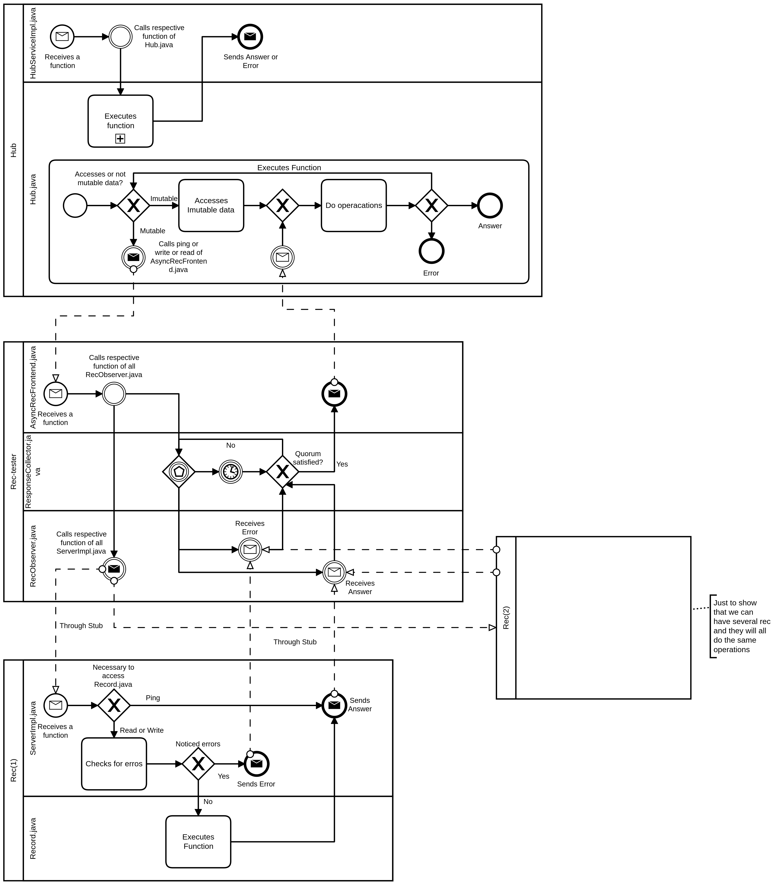

# Relatório do projeto *Bicloin*

Sistemas Distribuídos 2020-2021, segundo semestre

## Autores

**Grupo A66**

| Número | Nome              | Utilizador                                     | Correio eletrónico                              |
| -------|-------------------|------------------------------------------------| ------------------------------------------------|
| 92468  | Gonçalo Fernandes | <https://git.rnl.tecnico.ulisboa.pt/ist192468> | <mailto:goncalo.d.fernandes@tecnico.ulisboa.pt> |
| 92498  | João Antunes      | <https://git.rnl.tecnico.ulisboa.pt/ist192498> | <mailto:joao.pedro.c.a@tecnico.ulisboa.pt>      |
| 92567  | Vasco Rocha       | <https://git.rnl.tecnico.ulisboa.pt/ist192567> | <mailto:vascorocha2000@tecnico.ulisboa.pt>      |

  

## Melhorias da primeira parte

Correções:

- [Adicionado comando "help"; Adicionado ">" no inico da linha de comando; Adicionado synchronizeds no record; Feitas correções aos argumentos do main](https://git.rnl.tecnico.ulisboa.pt/SD-20-21-2/A66-Bicloin/commit/f06802eea4558cf4cfc5c0f6acce90317f2ebe42)

## Modelo de faltas

Faltas toleradas:
- Falha de um número de Records limitado, dependendo da importância que adquirem inicialmente (weight);
- Resposta muito demorada de um número de Records limitado;
- Acessos a registos inexistentes;
- Falha na comunicação entre Hub e Records;

Faltas não toleradas:

- Faltas bizantinas dos gestores de Records;
- Falha do Zookeeper;
- Falha de um número de Records superior ao suportado com os pesos;

## Solução

Embora o Record tenham um comportamento robusto, não é possível garantir que não pare de executar 
ou simplesmente não responda a mensagens do cliente.
A nossa solução quanto à tolerância desse tipo faltas consiste em ter várias réplicas de 
Records, possibilitando assim que um certo número de Records possa não responder ou eventualmente 
deixar de executar e, mesmo assim, que o cliente consiga obter respostas do servidor coerentes. 
Para isso, implementamos a funcionalidade de quoruns (melhor explicada abaixo) que consiste 
em garantir que um certo número de Records tem sempre os registos mais atualizados e coerentes. 
Deste modo, a execução do programa não é afetada quando um ou mais (até um certo número limitado) 
de Records deixa de executar, tornando o programa totalmente tolerante a estas faltas.

## Protocolo de replicação

Para garantir tanto a coerência dos Records como o desempenho, optamos por implementar o Protocolo Registo 
Coerente – versão completa, com algumas otimizações.
Para explicar o protocolo, começaremos então por explicar qual o problema que pertende resolver.
Na primeira parte do projeto, só existia, durante a execução do programa, um Record. Logo todo o programa
dependia do bom funcionamento desse Record. Para tolerar falhas silenciosas foi necessário aumentar o número
de Records existentes. 
Com mais records conseguimos aumentar a fiabilidade. No entanto, o programa aumenta o tempo de execução 
por um número de N vezes sendo N o número de Records existente, pois precisa de ler e escrever em 
todos eles.

O objetivo do protocolo é aumentar o desempenho sem sacrificar a coerência. Para tal utiliza o conceito 
de 'quoruns' que, na nossa implementação, é um número arbitario de Records que as operações de leitura e 
escrita usam para saber quantas respotas devem esperar, isto é, quantos Records necessitam de responder 
para a operação ter sucesso. Estes quoruns, para garantir coerência, necessitam de ser conjuntos de 
Records que tenham pelo menos um deles em comum, ou seja, a interseção dos quoruns (conjutos de Records)
da escrita e da leitura resulta em pelo menos 1 Record. 
Desta maneira sempre que há uma escrita num número N (sendo N o quorum de escrita) de Records, se 
houver uma leitura num número M (sendo M o quorum de leitura) de Records, no mínimo, 1 dos 
Records escritos, irá ser lido, garantindo a total coerência dos registos. No nosso caso inicial, 
N e M serão iguais e o seu valor é metade do número de Records mais 1.

Além disso, sempre que é realizada uma operação nos records, é tido em conta uma tag nos registos, 
composta por um número em sequência (que é incrementado a cada escrita) e um id de cliente (que no nosso caso irá ser sempre o mesmo pois só existe 1 cliente Hub). Esta tag é atualizada sempre que existe uma 
escrita num registo, sendo o valor da sequência da tag calculado pelo valor da sequência da tag mais 
alta já existente nos  registos iguais dos vários Records somando 1. Sempre que é feita uma 
operação de leitura, é selecionada das respotas recebidas dos Records (quorum) aquela que contém a 
tag mais elevada. Quando a operação de escrita é realizada, os Records também devolvem 
mensagens de acknoledge, para confirmar que a operação foi bem sucedida.

A troca de mensagens entre o cliente e servido (Hub e Records) começa quando o Hub faz o pedido de 
escrita ou leitura pelo *frontend* do Record (AsyncRecFrontend). Estes pedidos são feitos de 
forma assíncrona por *stubs* para aumentar a eficiência do servidor de registos e também possibilitar 
o protocolo, devido à funcionalidade dos quoruns. 
Cada Record irá, eventualmente, receber um pedido do *frontend* e em seguida enviar a sua resposta, 
que é guardada num objeto que fica responsável por guardar todas as respotas recebidas assíncronamente. 
Entretanto o *frontend* está à espera de um número, igual ao quorum, de respostas e, quando este número 
é atingido, procede a escolher a resposta mais relevante e a enviá-la de volta ao Hub. 
Podem ainda chegar respostas atrasadas de outros Records ao objeto que as guarda mas essas serão ignoradas.

## Medições de desempenho

| Tentativa Nº | Sem otimização (segundos) | Com otimização (segundos) |
| :----------: | :-----------------------: | :-----------------------: |
| 1            | 03.903                    | 03.878                    |
| 2            | 04.407                    | 03.726                    |
| 3            | 04.527                    | 03.790                    |
| 4            | 03.962                    | 03.628                    |
| 5            | 04.252                    | 03.713                    |
| Média        | 04.210                    | 03.747                    |

Reads: 2290
Writes: 605
Racio: 3.785

Devido às otimizações efetuadas, seria de esperar que o desempenho com otimizações fosse melhor, o que 
é verificado pela tabela. No entanto, a diferença não é grande, ou seja, o *speedup* obtido não foi 
muito elevado. Isto é devido ao facto das nossas otimizações serem mais impactantes num caso real, em 
que os vários Records estivem literalmente em sitios diferentes, com diferentes tempos de envio 
de mensagens, e em que houvessem muito mais Records ativos, tornando mais impactante a difernça no 
valor dos quoruns (explicado mais abaixo).
O rácio entre os reads e write também foi expectável pois numa operação de escrita, além de um write, 
é realizado um read, fazendo com que para cada leitura haja um read e para escrita haja um read e um write.
Deste modo, o rácio será sempre superior a 1, aumentando com quanto mais reads houverem.

## Opções de implementação

Decidimos implementar a funcionalidade de pesos como otimização ao protocolo de repliação. 
Esta funcionalidade permite que seja atribuido um peso arbitrário a cada réplica de Record, 
fazendo com que as réplicas mais rápidas tenham maior importância no quorum. Dito isto, o quorum, 
em vez de contar o número de Records, passa a contar um certo valor arbitrário que é definido pelos pesos.
Por exemplo, para um quorum de 3, tanto podem ser aceites réplicas de pesos 2 e 1, como de 1, 1, 0.5 e 0.5.
Para isso, temos uma função que se ocupa de calcular os pesos de cada Record dado o tempo que essa 
função demora a realizar uma operação de *ping* a cada um, respetivamente. Depois é calculada a média desses
valores e um intervalo superior e um inferior a essa media, havendo assim três conjuntos para três 
valores de pesos distintos definidos por padrão. Os Records que têm tempos abaixo do intervalo 
inferior têm peso 2 (ou seja, como são mais rápidos têm maior importancia), os tempos entre os 
dois intervalos têm peso 1 e os acima do intervalo superior têm peso 0.5.

Ainda falando em otimizações, quanto ao valor dos quoruns, decidimos mudar a implementação que definia 
o valor de ambos como metade dos Records mais 1, para valores separados entre a operação de leitura e 
de escrita. Mostrado também nas medições de desempenho, é fácil perceber que temos mais leituras do 
que escritas e, por isso, optamos por definir os quoruns de leitura com um valor mais baixo e, 
por contraste, o valor das escritas mais alto, de modo a manter o prósito dos quoruns. 
Para isso, é adicionado ao valor do peso total dos Records a unidade de peso mais baixa, 0.5, para 
que a soma do valor de ambos os quoruns seja superior ao peso total, garatindo a interseção de pelo 
menos um Record. Depois é atribuido à operação de leitura um quorum de um terço desse peso total mais 
0.5 e à operação de escrita um quorum de dois terços desse mesmo valor. Assim, tendo o quorum das 
leituras um valor menos mas que garante a coerência, podemos notar um *speedup* na execução do programa.

Quanto ao protocolo de replicação, decidimos não implementar a funcionalidade de Write Back devido a 
dois motivos: Pior desempenho, pois além de demorar mais tempo a executar, iria impedir que a 
otimização que muda o tamanho dos quoruns dependendo de ser read ou write tivesse efeito; 
Ineficaz pois não existe escrita e leitura concorrente, ou seja, uma operação de escrita só é dada 
por terminada quando recebe um número de respostas igual ao quorum. Dado que só existe um Hub 
(cliente do Records), mesmo com mais utilizadores (Apps), o Hub envia os seus pedidos e recebe as 
respotas sequencialmente, impedindo que existam operações concorrentes.

Por último, decidimos implentar o client id (cid), que teria o propósito de afetar o valor da tag. 
No entanto, é ineficaz, pois apenas tendo um cliente dos Records (o hub), o cid será sempre o mesmo 
(no nosso caso, 1).

A melhoria de desempenho devida às otimizações implementadas é verificada nas medições de desempenho, 
o que demonstra que as otimizações são viáveis.

## Notas finais

